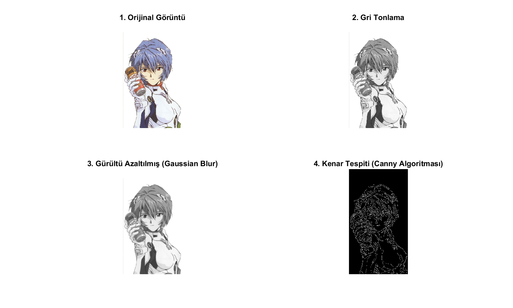

# MATLAB Görüntü Filtreleme ve Analiz Aracı

Bu proje, bilgisayar mühendisliği çalışmaları kapsamında sayısal görüntü işleme (Digital Image Processing) tekniklerini uygulamalı olarak göstermek amacıyla geliştirilmiştir. 

## Kullanılan Teknolojiler ve Algoritmalar
* **Dil / Ortam:** MATLAB
* **Gürültü Azaltma:** Gaussian Blur (`imgaussfilt`)
* **Kenar Tespiti:** Canny Edge Detection Algorithm (`edge`)
* **Renk Uzayı Dönüşümü:** RGB to Grayscale (`rgb2gray`)

## Proje Çıktısı
Aşağıdaki görselde; orijinal fotoğrafın önce gri tonlamaya çevrilmesi, ardından pürüzlerin giderilmesi için Gaussian Blur uygulanması ve son olarak Canny algoritması ile nesne sınırlarının tespit edilmesi aşamaları görülmektedir.

## Nasıl Çalıştırılır?
1. Repoyu bilgisayarınıza indirin.
2. MATLAB üzerinden klasör dizinine gidin.
3. `resim_okuma.m` dosyasını çalıştırın.
